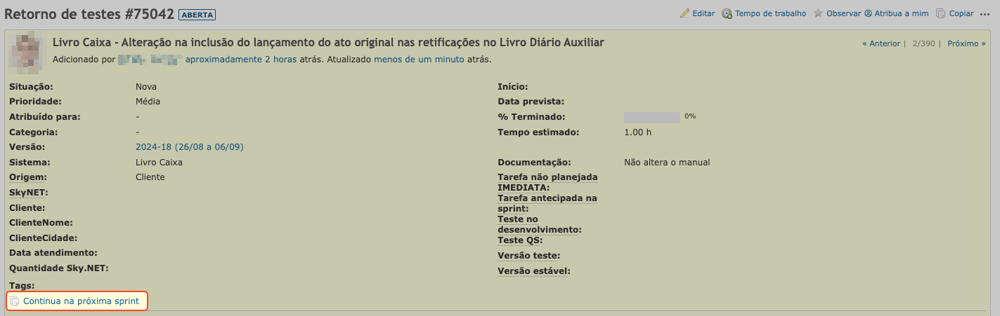
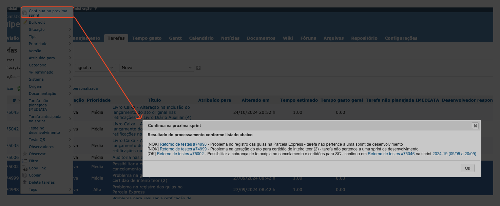
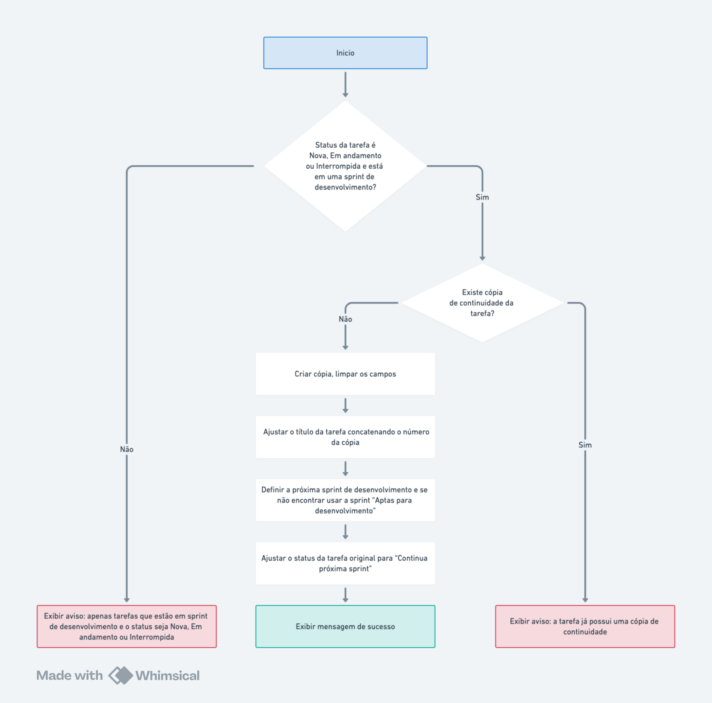

# **Continua na proxima sprint**

É possivel realizar uma cópia da tarefa para continuar na proxima sprint se ela estiver em uma sprint de desenvolvimento e o status for "Nova", "Em andamento" ou "Interrompida"

O cópia para continuar na próxima sprint pode ser feita pelo **link na visualização da tarefa** ou em lote através do **menu de contexto** com o clique do botão direito sobre a lista de tarefas, conforme imagem abaixo

## **Link na visualização da tarefa**

## **Menu de contexto na lista de tarefas**

## **Fluxogram para a cópia da tarefa que continua na próxima sprint**

- Criar uma nova tarefa copiando a tarefa de original para a próxima sprint de desenvolvimento
  - Limpar os campos da nova tarefa que foi criada
    - Atribuído para
    - Data de inicio
    - Percentual concluido
    - Tarefa não planejada IMEDIATA
    - Tarefa antecipada na sprint
    - Versão teste
    - Versão estável
    - Teste no desenvolvimento
    - Teste QS
  - Definir a sprint para a próxima sprint de desenvolvimento, se não encontrar vai definir a sprint "Aptas para desenvolvimento"
  - Concatenar o número da cópia no final do titulo da tarefa entre parenteses. Se for a primeira cópia vai concatenar o numero (2)
- Atualizar o status da tarefa original para "Continua proxima sprint"

Abaixo pode-se ver o fluxograma da execução das ações executadas

