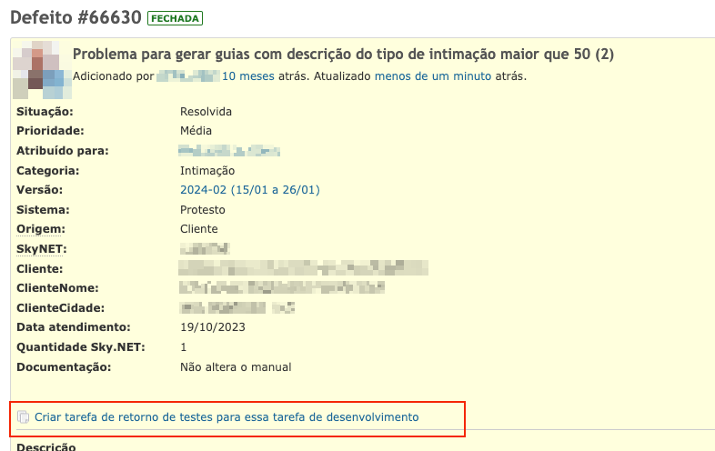

## **Criar tarefa de retorno de testes para tarefas do desenvolvimento**

Quando a tarefa de desenvolvimento estiver com o status "Resolvido", é possível criar uma tarefa de retorno de testes clicando no link "Criar tarefa de retorno de testes para essa tarefa de desenvolvimento", conforme exemplo abaixo.

Ao clicar no link, o Redmine criará uma nova tarefa a partir de uma cópia, realizando os ajustes necessários conforme a documentação [Fluxograma do processo de testes](https://docs.google.com/document/d/1H_ADkIaIxo5wy2QCW3bFRrw7l23HpUkaPUXaeZMbJCY/edit) e executando as seguintes ações.

- Criar um nova tarefa copiando a tarefa de desenvolvimento com o tipo "Retorno de testes"
  - Limpar os campos da nova tarefa que foi criada
    - Atribuído para
    - Data de inicio
    - Tags
    - Tarefa não planejada IMEDIATA
    - Tarefa antecipada na sprint
    - Responsável pelo teste
    - Teste no desenvolvimento
    - Teste QS
    - Versão estável
  - Definir a sprint para "Aptas para desenvolvimento" (caso existir)
  - Definir tempo estimado para 1 hora
- Atualizar o status da tarefa de desenvolvimento para "Fechada \- cont retorno testes"

Abaixo pode-se ver o fluxograma da execução das ações executadas

