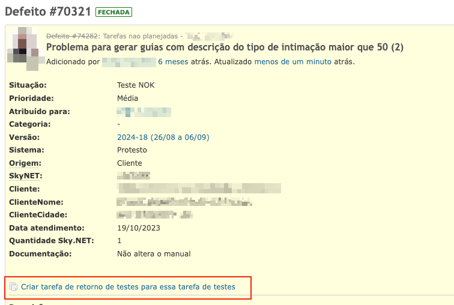

## **Criar tarefa de retorno de testes para tarefas do QS**

Quando a tarefa for dos projetos do QS e estiver com seu status "Teste NOK" é possível criar uma tarefa de retorno de testes clicando no link "Criar tarefa de retorno de testes para essa tarefa de testes" conforme exemplo abaixo

Ao clicar no link o Redmine irá criar uma nova tarefa apartir de uma cópia fazendo os ajustes necessários conforme a documentação [Fluxograma do processo de testes](https://docs.google.com/document/d/1H_ADkIaIxo5wy2QCW3bFRrw7l23HpUkaPUXaeZMbJCY/edit), realizando as seguintes ações

- Criar uma nova tarefa copiando a tarefa de QS com o tipo "Retorno de testes" para o projeto de desenvolvimento que originou a tarefa do QS
  - Limpar os campos da nova tarefa que foi criada
    - Atribuído para
    - Data de inicio
    - Tags
    - Tarefa não planejada IMEDIATA
    - Tarefa antecipada na sprint
    - Responsável pelo teste
    - Teste no desenvolvimento
    - Teste QS
    - Versão estável
  - Definir a sprint para "Aptas para desenvolvimento" (caso existir)
  - Definir tempo estimado para 1 hora
- Atualizar o status da tarefa de desenvolvimento (que originou a tarefa do QS) para "Fechada \- cont retorno testes"
- Atualizar o status da tarefa de QS para "Teste NOK \- Fechada"
- Limpar as tags da tarefa de testes

Abaixo pode-se ver o fluxograma da execução das ações executadas

