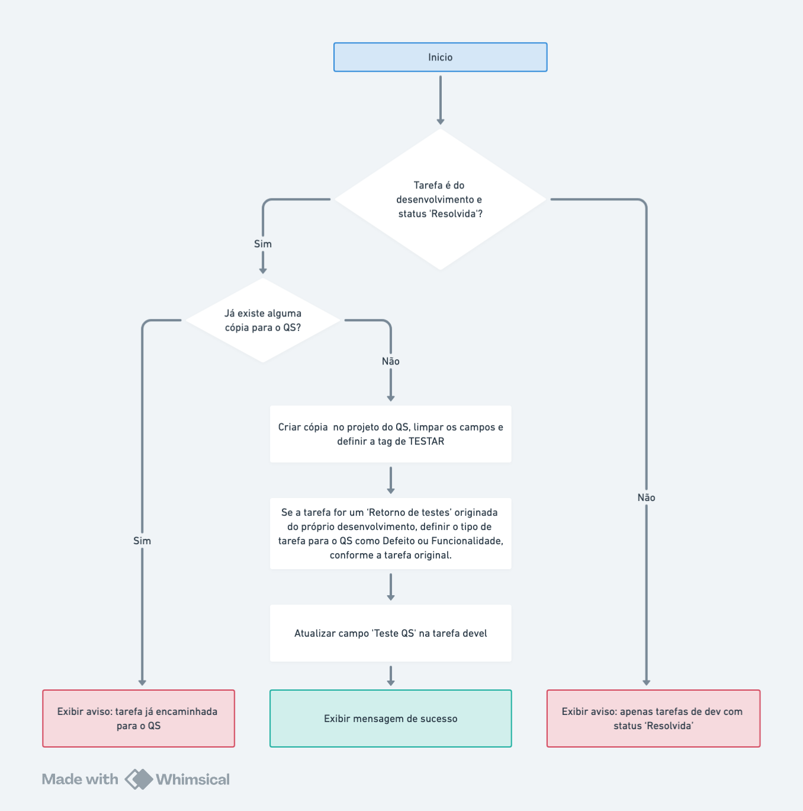

# **Encaminhar para o QS**

É possivel encaminhar uma tarefa do desenvolvimento tarefa para o QS se ela estiver com o status "Resolvida"

O encaminhamento para o QS pode ser feito pelo **link na visualização da tarefa** ou em lote através do **menu de contexto** com o clique do botão direito sobre a lista de tarefas, conforme imagem abaixo

## **Link na visualização da tarefa**

## **Menu de contexto na lista de tarefas**

## **Fluxogram para encaminhar a tarefa ao QS**

- Criar uma nova tarefa copiando a tarefa de desenvolvimento para o projeto de correspondente do QS (Notarial ou Registral)
  - Limpar os campos da nova tarefa que foi criada
    - Atribuído para
    - Data de inicio
    - Percentual concluido
    - Tarefa não planejada IMEDIATA
    - Tarefa antecipada na sprint
    - Versão estável
  - Definir a sprint para "Tarefas para testar" (caso existir)
  - Definir tempo estimado para 1/3 do tempo do desenvolvimento com no mínimo 1 hora
  - Definir a tag a "\_TESTAR"
  - Definir o tipo da tarefa para Defeito ou Funcionalidade, conforme a tarefa original do desenvolvimento (se a tarefa for um retorno de testes originada do proprio desenvolvimento)
- Atualizar o campo "Teste QS" da tarefa do desenvolvimento para "Nova"

Abaixo pode-se ver o fluxograma da execução das ações executadas

