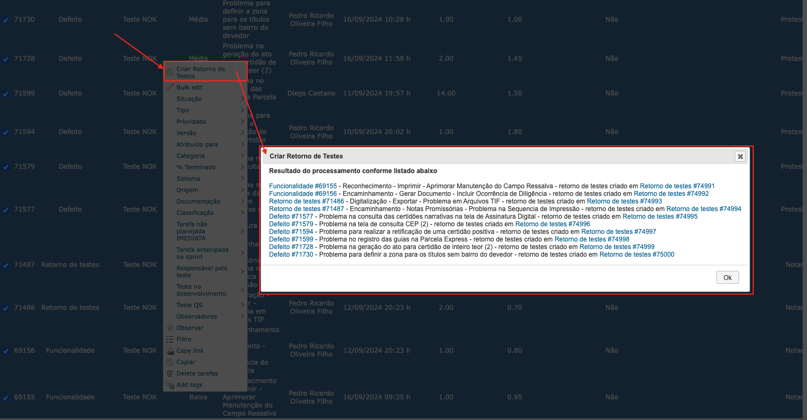

## **Criar tarefa de retorno de testes em lote**

Há possibilidade de criar as tarefas de retorno de testes em lote clicando com botão direito sobre a lista de tarefas e executando o item de menu "Criar Retorno de Testes" conforme imagem abaixo. Após a criação das tarefas de retorno de testes irá exibir uma mensagem com o resultado do processamento.

O algoritmo de criação das tarefas de retorno de testes está descrito em [Criar tarefa de retorno de testes para tarefas do QS](docs/criar-retorno-testes-qs.md) e [Criar tarefa de retorno de testes para tarefas do desenvolvimento](docs/criar-retorno-testes-devel.md)

