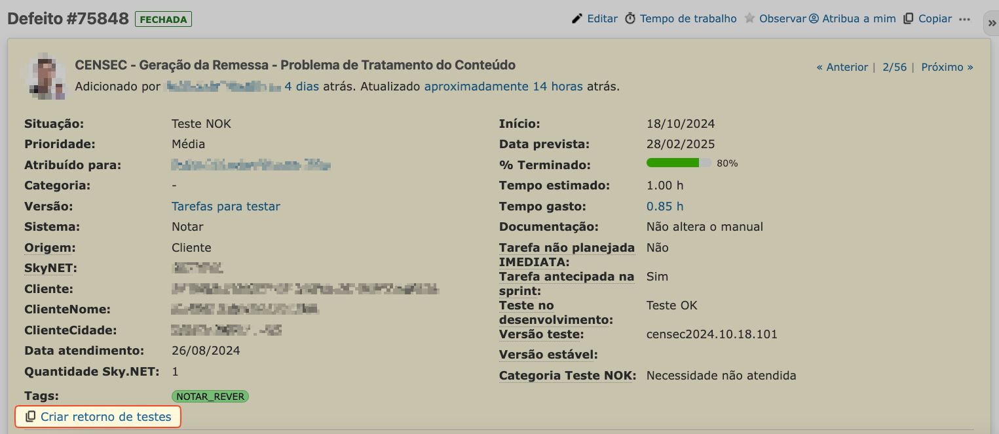
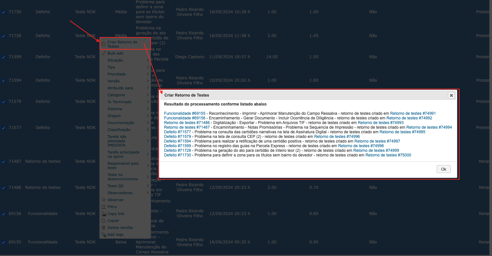
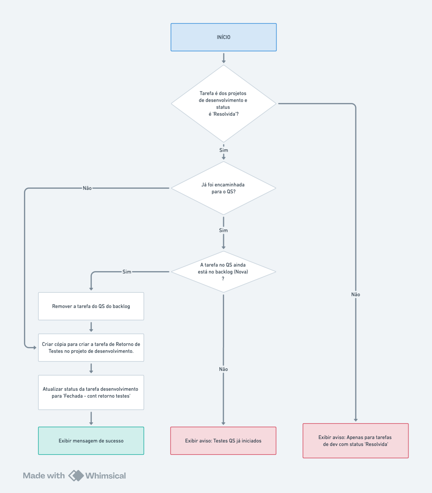
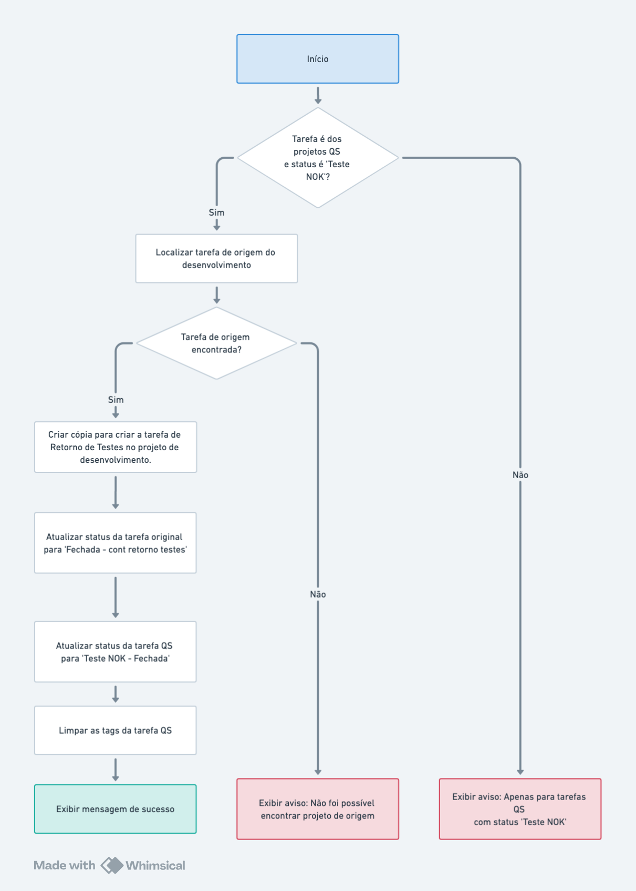

# **Criar tarefa de retorno de testes**

É possivel criar tarefa de retorno de testes tanto para tarefas do **desenvolvimento** quanto para tarefas do **QS**, conforme seguintes condicoes

- **Tarefas do desenvolvimento**: Quando estiver com o status "Resolvido"
- **Tarefas do QS**: Quando estiver com status "Teste NOK"

A criação da tarefa de retorno de testes é feito pelo **link na visualização da tarefa** ou em lote através do **menu de contexto** com o clique do botão direito sobre a lista de tarefas, conforme imagem abaixo

## **Link na visualização da tarefa**

## **Menu de contexto na lista de tarefas**

## **Fluxograma da criação do retorno de testes para tarefas do desenvolvimento**

- Criar um nova tarefa copiando a tarefa de desenvolvimento com o tipo "Retorno de testes"
  - Limpar os campos da nova tarefa que foi criada
    - Atribuído para
    - Data de inicio
    - Tags
    - Tarefa não planejada IMEDIATA
    - Tarefa antecipada na sprint
    - Responsável pelo teste
    - Teste no desenvolvimento
    - Teste QS
    - Versão estável
  - Definir a sprint para "Aptas para desenvolvimento" (caso existir)
  - Definir tempo estimado para 1 hora
- Atualizar o status da tarefa de desenvolvimento para "Fechada \- cont retorno testes"

Abaixo pode-se ver o fluxograma da execução das ações executadas

## **Fluxogram da criação do retorno de testes para tarefas do QS**

Ao clicar no link, o Redmine criará uma nova tarefa a partir de uma cópia, ajustando-a e realizando as seguintes ações.

- Criar uma nova tarefa copiando a tarefa de QS com o tipo "Retorno de testes" para o projeto de desenvolvimento que originou a tarefa do QS
  - Limpar os campos da nova tarefa que foi criada
    - Atribuído para
    - Data de inicio
    - Tags
    - Tarefa não planejada IMEDIATA
    - Tarefa antecipada na sprint
    - Responsável pelo teste
    - Teste no desenvolvimento
    - Teste QS
    - Versão estável
  - Definir a sprint para "Aptas para desenvolvimento" (caso existir)
  - Definir tempo estimado para 1 hora
- Atualizar o status da tarefa de desenvolvimento (que originou a tarefa do QS) para "Fechada \- cont retorno testes"
- Atualizar o status da tarefa de QS para "Teste NOK \- Fechada"
- Limpar as tags da tarefa de testes

Abaixo pode-se ver o fluxograma da execução das ações executadas

